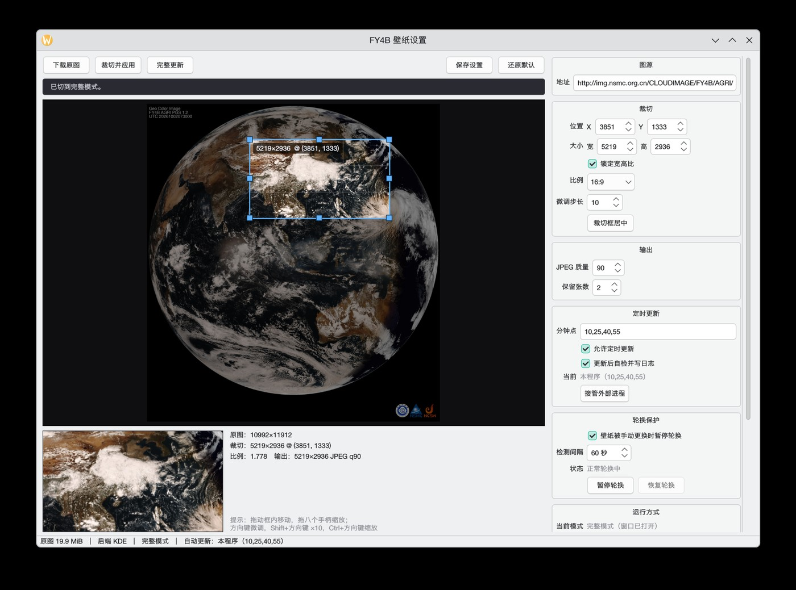

# satellite

本仓库（[MC-DALIU/satellite](https://github.com/MC-DALIU/satellite)）是
[storm-1614/satellite](https://github.com/storm-1614/satellite) 的**分支（fork）**，
只保留原项目中「把风云四号 B 星云图设为壁纸」这一个功能，并在此基础上做了精简和修改。

> **说明**：本仓库相对上游的改动（删除多余程序、修复 KDE 下壁纸不更新的 bug、
> 增加图形界面、重写 README）由 AI 协助完成，未经原作者审核。原项目的创意、
> 设计与绝大部分代码归 [storm-1614](https://github.com/storm-1614) 所有。



## 与上游的差异

| 内容 | 上游 | 本仓库 |
| --- | --- | --- |
| `Wallpaper/FY4B.py` | 风云四号 B 星云图壁纸 | **保留**，重构并修复了 bug |
| `Wallpaper/gui.py` | 无 | **新增**：设置界面、裁切预览、完整/轻量双模式、托盘、开机自启动 |
| `Wallpaper/H8.py` | 向日葵 9 号云图壁纸（依赖的链接早已失效） | 已删除 |
| `downloadDigitalTyphoon/` | 批量下载数字台风网图片 | 已删除 |

### 修复的问题：KDE Plasma 下后续更新壁纸不生效

原程序在 KDE Plasma 下只有第一次设置壁纸能成功，之后每次更新都看不到变化。
原因是 Plasma 的图像壁纸插件把配置项 `Image` 的取值**同时**用作两件事：

* 判断壁纸有没有变化（取值不变就不会收到变更通知）；
* 作为图片缓存的 key（取值不变就复用缓存里的旧图）。

而原程序每次都把同一个路径 `end.jpg` 写进配置，于是 Plasma 认为壁纸从未变化。
现在每轮剪裁都会生成带时间戳的新文件名（`end_<时间戳>.jpg`），使配置值和图片缓存
同时失效；切换完成后只保留最近几张，避免缓存目录无限增长。

### 每轮更新后自检

设置完壁纸后会回读桌面环境**当前实际在用的**壁纸，和刚写入的路径比对，结论直接
写进日志，不用靠肉眼盯着云图判断有没有刷新：

```
INFO - 壁纸已设置：end_20261002_113834_673079.jpg
INFO - 自检通过：2 块屏都已切到 end_20261002_113834_673079.jpg
```

不一致时会记成 `WARNING`，例如：

```
WARNING - 自检未通过：screen 0 实际在用 end_20261002_113834_673079.jpg，本轮写入 other.jpg
```

KDE 下这个接口读的是运行中的壁纸插件状态（`org.kde.PlasmaShell.wallpaper`），
不是磁盘上的配置文件，所以不会被"配置没落盘"骗到。可以在配置里用 `verify` 关掉。

### 其他改动

* **裁切框不再越界**：原代码写死的 `x=2400` 加宽 `8640` 已经超出原图右边界
  （宽 10992），超出部分会被补成黑边。现在统一做夹取，默认值实际落在 `2352`。
* **下载更稳**：所有 `requests` 异常都会重试、检查 HTTP 状态码、先写带 pid 的
  临时文件再原子替换，避免中途失败留下半张图被后续流程误用，也让界面和常驻进程
  可以安全地同时下载；并加了超时。
* **配置化**：缓存目录、裁剪框、JPEG 质量、更新分钟点等都可在配置文件里改，
  不用再改源码。
* **模块化**：`FY4B.py` 现在可以安全地被 `import`（不再一导入就抢锁、开调度器），
  图形界面就是这么复用它的。
* **轮换保护**：壁纸被手动换掉时自动暂停轮换并通知你，不会跟你抢壁纸。
* **单实例**：本地 socket + 文件锁双重保证，重复启动只会叫出已有窗口。

## 依赖

```bash
sudo pacman -S python-requests python-pillow python-filelock python-apscheduler python-dbus python-pyqt5 psmisc
```

* `python-pyqt5` 只有图形界面需要，纯命令行运行可以不装
* `python-dbus` 只有 KDE Plasma 需要
* `psmisc` 提供 `fuser`，用来查「谁正持有那把文件锁」（单实例判定、认出外部进程）。
  缺了它程序照样能跑，只是认不出没写过 pid 文件的老进程
* 在 `niri` 下需要 [awww](https://github.com/UnkwUsr/awww) 来设置壁纸
* 桌面通知优先走 D-Bus（KDE / GNOME 自带），失败才退回 `notify-send`（libnotify，可选）

## 使用

### 图形界面

```bash
python3 Wallpaper/gui.py
# 或者
python3 Wallpaper/FY4B.py --gui
```

界面左边是原图加裁切框，右边是设置：

* 裁切框可以**拖动框内**平移、拖**八个手柄**缩放，也可以在框上按**方向键微调**
  （`Shift` 加速 ×10，`Ctrl` 加方向键缩放裁切框），步长可在界面上调
* 勾选「锁定宽高比」后，缩放会保持比例，比例可选 16:9 / 16:10 / 21:9 / 4:3 / 1:1 / 屏幕比例
* 左下角是**实时裁切结果**，改框立刻能看到最终会得到哪一块画面
* 「裁切并应用」用已下载的原图裁一次并立刻设为壁纸（调构图时用这个，几秒完成）；
  「完整更新」会重新下载原图，走完整一轮
* 每次操作的成败会显示在按钮下方的横幅上（绿色 ✓ 成功 / 红色 ✗ 失败），同时写进日志
* 改完设置记得点「保存设置」（点「裁切并应用」/「完整更新」时会自动先保存）

### 两种运行模式

自动更新**始终由本程序这一个进程负责**，模式只决定「窗口显不显示」——所以切换模式
不重启进程、不碰文件锁，也就不会出现两个实例在跑。两种模式都能用托盘右键菜单切换：

| 模式 | 表现 |
| --- | --- |
| **完整模式** | 窗口打开，可以调裁切、看预览、改设置 |
| **轻量模式** | 窗口收起来，只在后台按配置更新；有没有托盘图标取决于「显示托盘图标」 |

* 关窗口 = 切到轻量模式（后台继续跑），**不是退出**
* 要真正退出：托盘菜单 →「退出」；如果托盘关掉了，关窗口时会先问你一次
* 轻量模式**连托盘都可以不要**：此时它就是个纯后台进程，想回到窗口再启动一次程序即可
* 不想要 Qt / 想在无桌面环境跑：可以直接用命令行的 `FY4B.py`（见下）

### 单实例

程序用两层保证不会出现多个实例：

1. 本地 socket（`QLocalServer`）：再次启动只会把已有实例的窗口叫出来，然后自己退出
2. 文件锁：**调度权**只能有一个持有者。如果锁被另一个本程序实例占着，新进程会
   自动退出；如果是命令行的 `FY4B.py` 占着，界面不会抢，只提示你点「接管外部进程」

界面里同时显示了当前模式、谁在负责自动更新。

### 轮换保护：壁纸被手动换掉就停下来

运行期间会每隔「检测间隔」检查一次桌面壁纸还是不是本程序设的那张（读的是运行中的
壁纸插件状态，不是磁盘配置）。**一旦发现被人手动换掉**：

1. 发一条桌面通知告诉你
2. 把「轮换已暂停」写进配置（跨模式、跨重启都有效），自动更新立刻停止
3. 界面里出现提示，点**「恢复轮换」**才会重新开始自动更新

手动点「裁切并应用」/「完整更新」不受暂停影响，但也**不会**自动解除暂停——只有
「恢复轮换」才会。首次运行还没设过壁纸时不做检测，避免误报。

### 开机自启动

设置面板里勾「开机自启动（轻量模式）」，会写一个 XDG autostart 文件到
`~/.config/autostart/fy4b-wallpaper.desktop`，登录时用**轻量模式**在后台跑，不会弹窗口。

### 命令行

```bash
python3 Wallpaper/FY4B.py              # 常驻，按配置的分钟点自动更新（不需要 Qt）
python3 Wallpaper/FY4B.py --once       # 只更新一次后退出
python3 Wallpaper/FY4B.py --download   # 只下载原图
python3 Wallpaper/FY4B.py --gui        # 打开图形界面
```

图形界面也支持 `--light` / `--full` 指定启动时的模式。

* 通过文件锁保证同时只有一个实例在运行
* 收到 `SIGTERM` / `Ctrl+C` 会优雅退出（关掉调度器、清掉 pid 文件）
* 下载的原图和生成的壁纸放在 `~/.cache/fy4b/`，日志写在 `~/.cache/fy4b/fy4b.log`；
  自己的 pid 记在 `~/.cache/fy4b/app.pid`
* 命令行守护进程同样会做「壁纸被换掉就暂停」的检测
* 默认每小时的 10、25、40、55 分更新一次
* 从睡眠唤醒后会立刻补一次更新

命令行守护进程和图形界面是**互斥**的（共用文件锁）：如果守护进程在跑，界面不会抢，
而是提示你点「接管外部进程」把它停掉、改由界面负责。手动操作（裁切并应用等）不受
影响，两边同时干活也是安全的——下载先写带 pid 的临时文件再原子替换，`raw.jpg`
任何时刻都是完整的。

风云四号 B 星的云图源在中国大陆可以直接访问，不需要代理。

## 配置

配置文件在 `~/.config/fy4b/config.json`，界面里改的项都会写到这里；直接手改也可以，
缺失的项会用默认值补齐。

| 键 | 默认值 | 说明 |
| --- | --- | --- |
| `url` | NSMC 的 FY4B 全圆盘真彩云图地址 | 图源 |
| `crop_x` / `crop_y` | `2400` / `1200` | 裁切框左上角（源图像素） |
| `crop_w` / `crop_h` | `8640` / `4860` | 裁切框大小（即输出尺寸） |
| `lock_aspect` | `true` | 是否锁定宽高比 |
| `nudge_step` | `10` | 方向键每次移动的像素数 |
| `jpeg_quality` | `90` | 输出 JPEG 质量 |
| `keep` | `2` | 缓存目录里保留最近几张壁纸 |
| `wallpaper_backend` | `auto` | `auto` / `KDE` / `niri` |
| `schedule_enabled` | `true` | 是否允许自动定时更新 |
| `schedule_minutes` | `10,25,40,55` | 每小时的哪几分钟更新 |
| `mode` | `full` | 启动模式：`full` / `light` |
| `enable_tray` | `true` | 是否显示托盘图标 |
| `autostart` | `false` | 开机自启动（实际看 `~/.config/autostart/` 里有没有那个文件） |
| `watch_wallpaper` | `true` | 是否检测壁纸被手动更换 |
| `watch_interval` | `60` | 检测间隔（秒） |
| `rotation_paused` | `false` | 轮换是否已暂停（由检测自动置位，点「恢复轮换」清除） |
| `last_applied` | `""` | 最近一次成功设置的壁纸，用于判断有没有被换掉 |
| `request_timeout` | `60` | 下载超时（秒） |
| `verify` | `true` | 设置壁纸后是否回读自检 |

## 支持的环境

* `niri`：调用 `awww img`
* `KDE Plasma`：通过 D-Bus 调用 plasmashell 的脚本接口

其他桌面环境暂时没有实现，设置壁纸的部分欢迎提交 Issue 或 PR。
上游 README 中提到的 `feh` 属于已删除的 `H8.py`，本仓库不再需要。

## 许可证与来源

上游 [storm-1614/satellite](https://github.com/storm-1614/satellite) **没有附任何许可证**，
本仓库作为它的分支，同样没有添加。也就是说代码著作权仍在原作者手里，
**在拿到明确授权之前，不建议把本仓库的代码复制进其他项目或再分发**。

如果你打算复用，建议先联系原作者确认授权方式（比如请他补一份 MIT / GPL）。

## 致谢

* 原项目：[storm-1614/satellite](https://github.com/storm-1614/satellite)
* 云图数据来源：国家卫星气象中心（NSMC）<http://www.nsmc.org.cn/>
